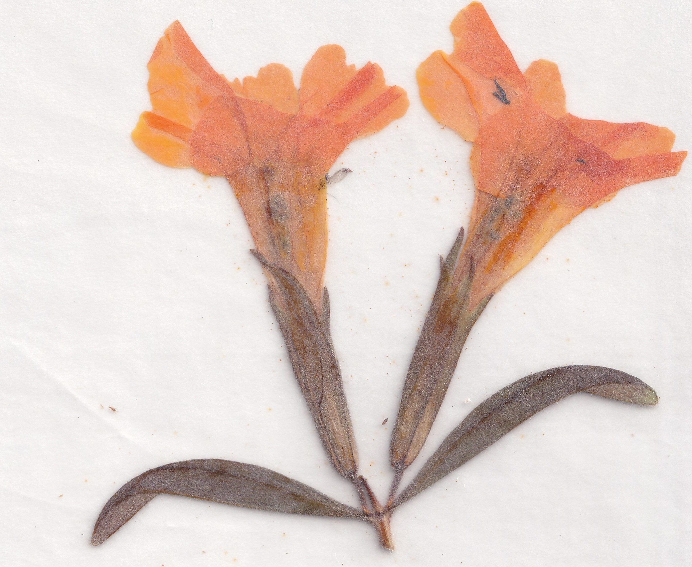

# Monkey Flower Press

- **Ice Breaker Guide for Business** (2025) - Inspired by real-life team building, Karen and Isabela dreamt up these [ice breakers](breakice.JPG) while meeting for Thai food on their respective lunch breaks. Use these innovative prompts to spark lively synergies at your next meeting.
- **Calendar & Coloring Book** (2025) - Using their daily diary postcards (2024), Isabela created a [calendar](calendar-25.JPEG) that can double as a coloring book. Each month features a thematic collage created by either Isabela or Karen, using the work of the other. It includes all the important holidays, like Unscented Lotion Day, Palmier Day and Test Your Pens Day.
- **Daily Postcards** (2024) - Starting in the spring, Karen and Isabela made a diary card a day (more or less) and mailed them to each other in batches. Fun mail! Here's an example from [Isabela](Sept14-24.jpg), and another from [Karen](May18-24.jpg).
- **Matches** (2023) - Isabela spearheaded this incendiary postcard project, inspired by Diamond Strike-on-Box matches, and perfect for bringing in the new year with mixed emotions. There are four flames to love: [sleepy](pc-sleepy.jpg), [smokin'](pc-smokin.jpg), [dyno](pc-blows.jpg) and [glad](pc-glad.jpg). 
- **Plants and Pollinators Garden Map** (2023) - Karen held a garden party and Isabela suggested and created an [illustrated map and key](garden-map_final.png) for guests to enjoy. Karen wrote an imagined conversation for the [flip side](garden-convo.pdf). Plant native plants!
- **Monkey Flower Poem** (2021-2022) - Our founding collaboration took a variety of forms, including a [bookmark](bookmark-stack.jpeg), [zine](mfp_zine.jpg) and [full page art submission](mfp_fullpage_monkeyflower_v4.pdf) for the Theodore Payne Native Plant Garden Tour Guide. You may happen upon a [forgotten bookmark](bookmark_back.jpg) inside select titles at the San Luis Obispo Public Library. 

## Shows & Events

- **Ontario Art Book Fair** - We appear as "Collective Three" at Ontario Museum of History & Art, Ontario, CA (2025)

## The Slow Pressers

[**Karen**](karen-photo.jpeg) enjoys her habitat garden. She also likes to read, write, dance and travel.

[**Isabela**](isabela-photo.jpeg) is—among other things—a writer of lists, adorer of stories, gatherer of her cat’s whiskers, and questioner of where all the dust bunnies in her room keep coming from.

[**Cate**](cate-photo.jpeg) steps into situations with a curious attitude and generous heart. 

You can reach us at monkeyflowerpress@gmail.com. We may be slow to reply…

*Diplacus aurantiacus is commonly known as monkey flower or sticky monkey-flower. It's a flowering perennial plant that grows in a subshrub form, native to southwestern North America from southwestern Oregon south through most of California and into Baja, Mexico. This genus has been subject to taxonomic debate. - [Calscape](https://calscape.org/Diplacus-aurantiacus-())*
